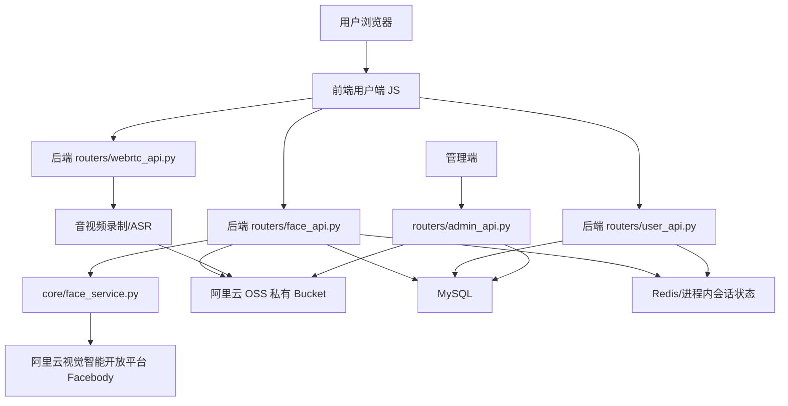

# AI 面试系统人脸核验与线上监考技术路线文档 v1.0

> 版本：v1.0  
> 更新时间：2026-06-01  
> 适用阶段：正式上线前开发、联调、验收与运维交接  
> 核心路线：DetectLivingFace + CompareFace + MonitorExamination  
> 决策结论：开始面试前强制身份核验，面试过程中持续抽帧监考，异常结果进入后台复核，不建议完全依赖自动判罚。

---

## 1. 背景与目标

当前系统已经具备用户注册登录、AI 面试、WebRTC 音视频采集、ASR 语音转写、LLM 追问、TTS 播报、MySQL 记录保存、OSS 归档和管理端复核能力。上线后，系统还必须解决远程面试中的身份可信和过程可信问题。

本次新增的人脸核验与线上监考能力，目标不是简单判断“画面里有没有脸”，而是形成完整的远程面试风控闭环：

- 面试前确认当前用户是注册或授权时登记的本人。
- 面试前确认当前画面是真人实拍，降低照片、屏幕翻拍、静态图片攻击风险。
- 面试过程中持续检查无人脸、多脸、低头、离开、耳机、手机等异常。
- 将异常事件沉淀到面试记录和管理端复核流程中。
- 满足正式上线对隐私、敏感信息、日志、安全和人工复核的要求。

---

## 2. 总体技术路线

### 2.1 选型结论

本项目采用阿里云视觉智能开放平台的人脸人体能力：

| 场景 | 使用能力 | 作用 |
| --- | --- | --- |
| 面试前活体检测 | DetectLivingFace | 判断当前摄像头截图中的人脸是否为近距离实拍活体 |
| 面试前身份比对 | CompareFace | 将当前截图与用户授权人脸照做 1:1 比对，判断是否为同一人 |
| 面试过程监考 | MonitorExamination | 检测无人脸、多脸、人体数量、脸部朝向、耳机、手机等异常 |

不优先使用的能力：

- SearchFace：适合 1:N 人脸库检索，不符合本项目“当前账号是否本人”的 1:1 核验需求。
- DetectFace：只能做人脸检测和关键点定位，不能单独证明是本人。
- DeepfakeFace：适合深伪鉴别，可作为后续增强项，不作为第一期上线阻断条件。
- ExecuteServerSideVerification：实名核身能力，涉及姓名、身份证号等更高敏感等级信息，除非业务明确要求实名制，否则不作为第一期必选能力。

### 2.2 核心原则

1. 所有阿里云 API 调用必须在后端完成，前端不能保存或暴露 AccessKey。
2. 人脸图片、监考截图必须存入私有 OSS Bucket。
3. 调用阿里云 API 时使用短时效签名 URL，建议有效期 300 秒。
4. 面试前核验必须强制通过，否则不允许创建面试会话。
5. 面试过程异常默认记录和提示复核，不建议直接中断面试。
6. 日志中禁止输出 base64 图片、签名 URL、原始敏感返回体、身份证号等敏感信息。
7. 管理端必须保留人工复核入口，不能完全依赖算法自动淘汰。

---

## 3. 目标业务流程

### 3.1 首次人脸登记流程

适用场景：

- 用户首次注册后。
- 用户首次开始面试前。
- 人脸授权照过期或管理员要求重新采集时。

流程：

1. 前端展示人脸采集与隐私授权说明。
2. 用户勾选同意采集、存储、处理人脸照片及监考截图。
3. 前端打开摄像头，采集一张清晰正脸照。
4. 前端调用 `POST /api/face/enroll` 上传图片。
5. 后端校验登录态、图片大小、图片类型、频率限制。
6. 后端将图片上传至 OSS 私有路径。
7. 后端可选调用 `DetectLivingFace` 检查授权照是否为活体。
8. 后端保存用户人脸 OSS Key、授权时间、协议版本。
9. 前端进入面试前核验步骤。

建议：

- 正式上线建议人脸登记阶段也做一次活体检测，避免用户上传照片作为基准照。
- 如果体验压力较大，可以在第一期允许登记照只做基础质量校验，但开始面试前必须做活体。

### 3.2 开始面试前核验流程

这是强制流程，必须在 `start_interview` 之前完成。

流程：

1. 前端打开摄像头并截取当前画面。
2. 前端调用 `POST /api/face/precheck`。
3. 后端上传当前截图到 OSS 私有路径。
4. 后端生成当前截图短时效签名 URL。
5. 后端生成用户基准人脸照短时效签名 URL。
6. 后端调用 `DetectLivingFace` 检测当前截图是否为活体。
7. 活体通过后，后端调用 `CompareFace` 进行 1:1 人脸比对。
8. 分数达到阈值后，后端写入 Redis 或会话状态：`face_verified=true`。
9. 前端再调用 `POST /api/user/start_interview`。
10. `start_interview` 校验当前用户近期是否完成核验，未通过则拒绝创建面试。

建议通过条件：

- `DetectLivingFace` 返回活体通过。
- `CompareFace` 分数达到系统阈值。
- 核验时间在有效期内，建议 5 分钟。
- 当前登录用户和核验用户一致。

### 3.3 面试过程监考流程

流程：

1. WebRTC 面试开始后，前端每隔 30-60 秒从本地 video 画面截一帧。
2. 前端调用 `POST /api/face/proctoring` 上传截图和 `session_id`。
3. 后端校验会话归属、面试状态、频率限制。
4. 后端上传截图到 OSS 私有路径。
5. 后端生成短时效签名 URL。
6. 后端调用 `MonitorExamination`。
7. 后端解析返回结果，转换为标准风险事件。
8. 后端写入 `proctoring_events` 表。
9. 后端更新 `interview_records.proctoring_risk_level` 和 `proctoring_flags_json`。
10. 管理端展示异常汇总和截图证据。

不建议自动中断的原因：

- 摄像头抖动、网络卡顿、光线变化可能导致误报。
- 用户短暂低头看题或调整设备不一定是作弊。
- 自动中断会带来申诉和运营风险。

建议策略：

- 低风险：只记录。
- 中风险：记录并在前端轻提示，例如“请保持面部在画面中央”。
- 高风险：记录为重点复核项，可提示用户调整。
- 极高风险或连续异常：可允许后台配置是否中止面试。

---

## 4. 系统架构设计

### 4.1 架构图



### 4.2 新增后端模块

建议新增：

- `core/face_service.py`
  - 封装阿里云 Facebody OpenAPI 调用。
  - 屏蔽 SDK 细节。
  - 统一错误处理、重试、超时、结果标准化。

- `routers/face_api.py`
  - 对前端提供人脸登记、面试前核验、过程监考接口。
  - 校验用户登录态、会话归属、频率限制。
  - 不直接暴露云服务原始返回。

- `core/face_models.py` 或直接扩展 `core/database.py`
  - 增加人脸登记字段。
  - 增加监考事件表。

- `core/face_policy.py`
  - 统一阈值、风险等级、异常聚合规则。
  - 便于运营后续调整。

### 4.3 前端改造模块

建议在用户端新增：

- `frontend/user/js/face_capture.js`
  - 负责摄像头截图。
  - 压缩图片。
  - 检查浏览器权限。
  - 控制截帧频率。

- `frontend/user/js/face_api.js`
  - 封装 `/api/face/*` 请求。

现有页面需要改造：

- 登录后或开始面试前增加人脸登记状态判断。
- 开始面试按钮前增加身份核验步骤。
- 面试过程中启动定时监考截帧。
- 面试结束、取消、断线时停止监考定时器。

---

## 5. API 设计

### 5.1 查询人脸登记状态

`GET /api/face/status`

用途：

- 前端判断用户是否已登记人脸。
- 判断是否需要重新授权或重新采集。

返回示例：

```json
{
  "status": "success",
  "enrolled": true,
  "face_enrolled_at": "2026-06-01T10:00:00",
  "consent_version": "2026-06-01",
  "need_reenroll": false
}
```

### 5.2 登记授权人脸

`POST /api/face/enroll`

请求：

- `multipart/form-data`
- 字段：
  - `image`: 图片文件，建议 jpg/webp/png。
  - `consent_version`: 当前隐私授权版本。

后端处理：

1. 校验 JWT。
2. 校验图片大小，建议不超过 2 MB。
3. 上传 OSS：`face/enroll/{user_id}/{uuid}.jpg`。
4. 可选调用 `DetectLivingFace`。
5. 保存人脸基准图 OSS Key。

返回示例：

```json
{
  "status": "success",
  "message": "face enrolled",
  "enrolled": true
}
```

### 5.3 面试前核验

`POST /api/face/precheck`

请求：

- `multipart/form-data`
- 字段：
  - `image`: 当前摄像头截图。

后端处理：

1. 校验 JWT。
2. 查询用户是否已登记人脸。
3. 上传当前截图到 OSS：`face/precheck/{user_id}/{uuid}.jpg`。
4. 调用 `DetectLivingFace`。
5. 调用 `CompareFace`。
6. 根据阈值判断是否通过。
7. 通过后写入 Redis：
   - Key：`face_verified:{user_email}`
   - TTL：300 秒
   - Value：核验时间、分数、截图 OSS Key。

返回示例：

```json
{
  "status": "success",
  "verified": true,
  "liveness_passed": true,
  "compare_score": 86.7,
  "expires_in": 300
}
```

失败返回示例：

```json
{
  "status": "error",
  "code": "face_verify_failed",
  "message": "身份核验未通过，请调整光线并重新核验",
  "verified": false
}
```

### 5.4 过程监考

`POST /api/face/proctoring`

请求：

- `multipart/form-data`
- 字段：
  - `session_id`: 面试会话 ID。
  - `image`: 当前摄像头截图。
  - `client_captured_at`: 前端截图时间，可选。

后端处理：

1. 校验 JWT。
2. 校验 `session_id` 归属当前用户。
3. 校验面试状态。
4. 做频率限制，避免恶意高频调用。
5. 上传截图到 OSS：`face/proctoring/{session_id}/{timestamp}.jpg`。
6. 调用 `MonitorExamination`。
7. 解析风险事件。
8. 写入 `proctoring_events`。
9. 返回简化后的风险结果。

返回示例：

```json
{
  "status": "success",
  "risk_level": "medium",
  "flags": ["multiple_faces", "phone_detected"],
  "suggestion": "请保持本人单独出现在画面中"
}
```

---

## 6. 数据库设计

### 6.1 users 表新增字段

```sql
ALTER TABLE users ADD COLUMN face_image_oss_key VARCHAR(255) DEFAULT '';
ALTER TABLE users ADD COLUMN face_enrolled_at DATETIME NULL;
ALTER TABLE users ADD COLUMN face_consent_at DATETIME NULL;
ALTER TABLE users ADD COLUMN face_consent_version VARCHAR(50) DEFAULT '';
```

说明：

- `face_image_oss_key` 保存 OSS Key，不保存公开 URL。
- `face_consent_at` 用于证明用户已授权。
- `face_consent_version` 用于后续隐私协议版本变更时要求重新授权。

### 6.2 interview_records 表新增字段

```sql
ALTER TABLE interview_records ADD COLUMN face_verify_status VARCHAR(50) DEFAULT 'pending';
ALTER TABLE interview_records ADD COLUMN face_verify_score FLOAT NULL;
ALTER TABLE interview_records ADD COLUMN face_verify_at DATETIME NULL;
ALTER TABLE interview_records ADD COLUMN face_verify_snapshot_oss_key VARCHAR(255) DEFAULT '';
ALTER TABLE interview_records ADD COLUMN proctoring_risk_level VARCHAR(50) DEFAULT 'none';
ALTER TABLE interview_records ADD COLUMN proctoring_flags_json TEXT;
```

说明：

- `face_verify_status` 可取值：`pending`、`passed`、`failed`、`expired`、`skipped`。
- `proctoring_risk_level` 可取值：`none`、`low`、`medium`、`high`、`critical`。
- `proctoring_flags_json` 保存聚合后的异常类型和次数。

### 6.3 新增 proctoring_events 表

```sql
CREATE TABLE proctoring_events (
    id INT PRIMARY KEY AUTO_INCREMENT,
    session_id VARCHAR(50) NOT NULL,
    user_email VARCHAR(100) NOT NULL,
    event_type VARCHAR(80) NOT NULL,
    risk_level VARCHAR(50) DEFAULT 'low',
    image_oss_key VARCHAR(255) DEFAULT '',
    raw_result_json TEXT,
    client_captured_at DATETIME NULL,
    created_at DATETIME DEFAULT CURRENT_TIMESTAMP,
    INDEX idx_proctoring_events_session_id (session_id),
    INDEX idx_proctoring_events_user_email (user_email),
    INDEX idx_proctoring_events_event_type (event_type)
);
```

建议事件类型：

- `no_face`
- `multiple_faces`
- `face_not_centered`
- `head_down`
- `head_turned`
- `person_absent`
- `multiple_persons`
- `phone_detected`
- `earphone_detected`
- `screen_abnormal`
- `api_error`

---

## 7. OSS 存储设计

### 7.1 Bucket 策略

必须使用私有 Bucket：

- 禁止公共读。
- 禁止前端直传使用长期凭证。
- 后端负责上传和生成签名 URL。
- 签名 URL 有效期建议 300 秒。

### 7.2 路径规划

```text
face/
  enroll/
    {user_id}/
      {uuid}.jpg
  precheck/
    {user_id}/
      {uuid}.jpg
  proctoring/
    {session_id}/
      {timestamp}_{uuid}.jpg
records/
  audio_video/
    {session_id}.webm
```

### 7.3 生命周期策略

建议配置：

- 登记人脸照：账号存在期间保留；用户注销或撤回授权后删除。
- 面试前核验截图：建议保留 30-90 天，或随面试记录保留。
- 监考截图：建议保留到复核完成后 30 天。
- 签名 URL：只临时生成，不入库、不写日志。

---

## 8. 阿里云接入设计

### 8.1 控制台准备

1. 地域选择：华东 2（上海）。
2. 开通视觉智能开放平台。
3. 在人脸人体类目下确认以下能力可用：
   - DetectLivingFace
   - CompareFace
   - MonitorExamination
4. OSS Bucket 建议和视觉智能服务同地域。
5. 新建 RAM 用户或 RAM 角色，避免使用主账号 AccessKey。
6. 为 RAM 用户授权：
   - 视觉智能开放平台调用权限。
   - OSS 指定 Bucket 的 PutObject、GetObject、DeleteObject、签名读取权限。

### 8.2 Python 依赖

建议在 `requirements.txt` 增加：

```text
alibabacloud_facebody20191230
alibabacloud_tea_openapi
alibabacloud_tea_util
```

现有项目已经有：

```text
aliyun-python-sdk-core
oss2
```

### 8.3 环境变量

建议新增：

```env
ALI_FACEBODY_ENDPOINT=facebody.cn-shanghai.aliyuncs.com
FACE_VERIFY_ENABLED=true
FACE_COMPARE_THRESHOLD=70
FACE_LIVENESS_REQUIRED=true
FACE_VERIFY_TTL_SECONDS=300
FACE_IMAGE_SIGN_EXPIRE_SECONDS=300
FACE_IMAGE_MAX_BYTES=2097152
FACE_CONSENT_VERSION=2026-06-01
PROCTORING_ENABLED=true
PROCTORING_INTERVAL_SECONDS=45
PROCTORING_MIN_INTERVAL_SECONDS=25
PROCTORING_STORE_RAW_RESULT=false
```

阈值说明：

- `FACE_COMPARE_THRESHOLD=70` 是初始建议值，最终应根据真实测试样本调优。
- 线上应保存每次核验分数，观察误拒率和误过率。
- 不建议上线第一天就把阈值设得过高，否则容易影响正常用户进入面试。

### 8.4 face_service.py 设计

建议返回统一结构，避免业务层直接依赖阿里云原始字段。

```python
{
    "ok": True,
    "provider": "aliyun_facebody",
    "action": "CompareFace",
    "request_id": "...",
    "passed": True,
    "score": 86.7,
    "flags": [],
    "raw": {}
}
```

注意：

- `raw` 默认不入日志。
- 生产环境可通过配置决定是否入库原始结果。
- API 失败时返回标准错误码，例如 `provider_timeout`、`provider_error`、`invalid_image`。

---

## 9. 与现有业务流程的集成点

### 9.1 start_interview 强制校验

现有入口：

- `routers/user_api.py`
- `POST /api/user/start_interview`

改造要求：

1. 获取当前登录用户邮箱。
2. 检查 `FACE_VERIFY_ENABLED`。
3. 如果开启，则检查 Redis 或会话状态中是否有近期通过的人脸核验记录。
4. 未通过则返回错误，不创建面试 session。
5. 通过后，将核验结果绑定到新创建的 `session_id`。

返回示例：

```json
{
  "status": "error",
  "code": "face_precheck_required",
  "message": "请先完成人脸身份核验"
}
```

### 9.2 面试记录保存

面试完成生成 `InterviewRecord` 时，需要写入：

- `face_verify_status`
- `face_verify_score`
- `face_verify_at`
- `face_verify_snapshot_oss_key`
- `proctoring_risk_level`
- `proctoring_flags_json`

如果当前系统是在后台任务 `interview_job_service.py` 中落库，应在任务 payload 或 session runtime 中携带这些字段。

### 9.3 管理端展示

管理端记录列表建议新增：

- 身份核验状态。
- 人脸比对分数。
- 监考风险等级。
- 异常次数。

记录详情页建议新增：

- 面试前核验结果。
- 过程异常时间线。
- 异常截图预览，使用后端短时效签名 URL。
- 管理员复核备注。

---

## 10. 前端交互设计

### 10.1 用户端页面状态

建议状态机：

```text
未登录
  -> 已登录
  -> 检查人脸登记状态
  -> 未登记：采集授权人脸
  -> 已登记：面试前身份核验
  -> 核验通过：允许开始面试
  -> 面试中：启动过程监考
  -> 面试结束：停止过程监考
```

### 10.2 截图实现建议

前端可以使用 `<video>` + `<canvas>`：

1. `navigator.mediaDevices.getUserMedia({ video: true, audio: true })`
2. 将摄像头流绑定到 video。
3. canvas 按固定尺寸绘制当前帧。
4. 使用 `canvas.toBlob()` 得到 jpg/webp。
5. 使用 `FormData` 上传。

建议参数：

- 图片宽度：640-960。
- 图片格式：jpg。
- 压缩质量：0.75-0.85。
- 上传大小：不超过 2 MB。

### 10.3 用户提示

建议文案：

- “请正对摄像头，保持面部完整出现在画面中。”
- “请确保光线充足，避免逆光、遮挡、戴口罩。”
- “系统将仅用于本次面试身份核验和过程复核。”
- “面试过程中请保持本人单独在画面中。”

避免文案：

- 不要写“系统将自动判定作弊并取消资格”。
- 不要承诺“人脸识别 100% 准确”。

---

## 11. 风险等级与复核策略

### 11.1 风险等级

| 风险等级 | 触发示例 | 系统动作 |
| --- | --- | --- |
| none | 未发现异常 | 不提示，只记录正常状态 |
| low | 短暂偏头、画面质量较差 | 记录，可不提示 |
| medium | 短暂无人脸、低头、多次偏离画面 | 记录，前端轻提示 |
| high | 多人脸、手机、耳机、长时间无人脸 | 记录，详情页重点标记 |
| critical | 连续高风险、多次身份复核失败 | 记录，可按后台配置中止或要求重新核验 |

### 11.2 聚合规则建议

示例：

- 10 分钟内 `no_face` >= 3 次：`medium`
- 任意一次 `multiple_faces`：`high`
- 任意一次 `phone_detected`：`high`
- 连续 3 次 `no_face`：`high`
- `CompareFace` 复核失败：`critical`

### 11.3 人工复核

后台复核必须能看到：

- 异常类型。
- 异常发生时间。
- 异常截图。
- 面试录像。
- 系统建议风险等级。
- 管理员最终处理意见。

最终结论应由管理员确认：

- 待复核。
- 通过。
- 疑似异常。
- 不通过。

---

## 12. 安全、隐私与合规

### 12.1 敏感数据范围

以下均属于敏感数据：

- 用户人脸授权照。
- 面试前核验截图。
- 过程监考截图。
- 面试音视频。
- 人脸比对分数。
- 阿里云 API 原始返回。
- OSS 签名 URL。

### 12.2 必须实现的安全措施

1. OSS Bucket 私有化。
2. 使用短时效签名 URL 调用云服务。
3. 不向前端返回 OSS 永久地址。
4. 不在日志中输出图片、签名 URL、完整原始返回。
5. 后端接口必须校验 JWT。
6. `session_id` 必须校验归属，不能只靠前端传参。
7. 上传图片限制大小、类型、频率。
8. 管理端查看截图时也通过后端生成短时效签名 URL。
9. 人脸数据设置保留期限。
10. 用户撤回授权或账号注销时，应提供删除机制。

### 12.3 隐私授权文案要求

上线前页面必须明确告知：

- 采集哪些信息。
- 用于什么目的。
- 保存多久。
- 谁可以查看。
- 如何申请删除或撤回授权。
- 不同意时是否无法参加线上面试。

建议记录：

- 用户同意时间。
- 协议版本。
- 用户账号。
- 客户端 IP。

---

## 13. 容错与降级

### 13.1 阿里云接口失败

情况：

- 网络超时。
- 服务限流。
- 图片不符合要求。
- 阿里云服务异常。

处理建议：

- 面试前核验失败：允许用户重试 2-3 次。
- 多次服务异常：提示稍后重试或联系管理员。
- 不建议在核验服务不可用时直接放行，除非后台开启人工白名单。

### 13.2 过程监考失败

处理建议：

- 单次失败记录 `api_error`。
- 不影响当前面试继续。
- 连续失败进入后台风险提示。
- 运维监控需要统计失败率。

### 13.3 浏览器摄像头权限失败

处理建议：

- 提示用户开启摄像头权限。
- 提供刷新检测入口。
- 如果没有摄像头，不允许进入正式线上面试。

---

## 14. 监控与告警

建议记录指标：

- 人脸登记成功率。
- 面试前核验通过率。
- 活体检测失败率。
- 人脸比对失败率。
- CompareFace 分数分布。
- MonitorExamination 调用成功率。
- 单场面试平均监考截图数。
- 高风险事件比例。
- 阿里云 API 平均耗时和错误码。

建议告警：

- 人脸核验接口 5xx 激增。
- 阿里云 API 失败率超过 5%。
- OSS 上传失败率超过 1%。
- 面试前核验通过率异常下降。
- 监考事件量异常升高。

---

## 15. 测试方案

### 15.1 单元测试

覆盖：

- OSS Key 生成。
- 图片大小和类型校验。
- 风险等级聚合。
- CompareFace 分数阈值判断。
- Redis 核验状态 TTL。
- `start_interview` 未核验拒绝。

### 15.2 集成测试

覆盖：

- 用户登记人脸。
- 面试前核验成功。
- 面试前核验失败。
- 未核验调用 `start_interview` 被拒绝。
- 核验通过后调用 `start_interview` 成功。
- 监考截图写入事件表。
- 管理端能看到风险汇总。

### 15.3 真实设备测试

至少测试：

- Windows Chrome。
- macOS Chrome/Safari。
- 手机浏览器如果支持移动端面试。
- 弱光。
- 逆光。
- 戴眼镜。
- 戴耳机。
- 多人进入画面。
- 用户短暂离开。
- 摄像头权限拒绝。
- 网络较差。

### 15.4 压测

重点不是图片接口的 QPS 峰值，而是和现有面试链路叠加后的整体资源压力：

- 100 人同时面试，每 45 秒截帧一次。
- 300 人同时面试，每 60 秒截帧一次。
- OSS 上传带宽。
- 阿里云 API QPS 限制。
- MySQL 监考事件写入压力。

---

## 16. 实施排期

### 阶段一：基础能力接通

目标：

- OSS 私有上传和签名 URL。
- `face_service.py` 调通三个阿里云能力。
- 本地用测试图片完成 API 验证。

交付物：

- `core/face_service.py`
- `core/oss_utils.py` 私有签名能力
- 基础测试脚本

### 阶段二：面试前强制核验

目标：

- 人脸登记。
- 活体检测。
- 1:1 比对。
- `start_interview` 强制依赖核验状态。

交付物：

- `routers/face_api.py`
- users 表新增字段
- 前端采集和核验流程

### 阶段三：面试过程监考

目标：

- 面试中定时截帧。
- MonitorExamination 接入。
- 事件入库。
- 风险等级聚合。

交付物：

- `proctoring_events` 表
- 前端定时截帧
- 过程监考接口

### 阶段四：管理端复核与上线加固

目标：

- 管理端展示风险汇总和异常证据。
- 日志脱敏。
- 告警和指标。
- 隐私授权文案。
- 压测和灰度上线。

交付物：

- 管理端详情页增强
- 上线检查表
- 运维告警配置

---

## 17. 上线检查清单

控制台：

- [ ] Facebody 三个能力已开通。
- [ ] OSS Bucket 为私有。
- [ ] RAM 用户不是主账号。
- [ ] RAM 权限已按最小权限收敛。
- [ ] QPS、额度、计费方式已确认。

后端：

- [ ] `face_service.py` 有超时和异常处理。
- [ ] 图片上传有大小、类型、频率限制。
- [ ] 签名 URL 不入库、不写日志。
- [ ] `start_interview` 已强制校验人脸预核验。
- [ ] `session_id` 归属校验已完成。
- [ ] 管理端查看截图使用短时效签名。

前端：

- [ ] 用户授权文案已展示。
- [ ] 用户未授权不能进入正式面试。
- [ ] 摄像头权限异常有明确提示。
- [ ] 面试结束后停止截帧定时器。
- [ ] 上传失败不会卡死主流程。

数据库：

- [ ] users 表新增字段已上线。
- [ ] interview_records 表新增字段已上线。
- [ ] proctoring_events 表已上线。
- [ ] 索引已创建。
- [ ] 数据保留和删除策略已确认。

安全合规：

- [ ] 人脸数据不出现在普通日志。
- [ ] 隐私协议已更新。
- [ ] 用户同意记录已保存。
- [ ] 管理员访问有审计。
- [ ] 用户撤回授权和数据删除流程已定义。

运维：

- [ ] 阿里云 API 失败率有监控。
- [ ] OSS 上传失败有监控。
- [ ] 人脸核验通过率有看板。
- [ ] 高风险监考事件有后台筛选。
- [ ] 灰度开关可关闭人脸监考，但不能随意绕过身份核验。

---

## 18. 关键风险与应对

### 18.1 误拒正常用户

风险：

- 光线差、摄像头质量低、戴眼镜、角度偏移会导致失败。

应对：

- 允许重试。
- 给出明确拍摄提示。
- 阈值先保守，基于真实数据调优。
- 提供人工处理入口。

### 18.2 误报作弊行为

风险：

- 短暂低头、网络卡顿、画面模糊可能被识别为异常。

应对：

- 过程监考以记录和复核为主。
- 使用连续异常和次数聚合，不用单次事件直接判罚。

### 18.3 人脸数据泄露

风险：

- OSS 公开读、日志泄露、前端暴露 URL、管理员滥用。

应对：

- 私有 Bucket。
- 短时效签名。
- 日志脱敏。
- 管理员操作审计。
- 数据生命周期清理。

### 18.4 成本和 QPS 超限

风险：

- 大并发面试时，过程监考调用量明显增加。

应对：

- 监考间隔默认 45 秒。
- 后台可配置间隔。
- 高峰期按用户分批。
- 监控 API 调用量和费用。

---

## 19. 验收标准

必须满足：

- 用户未登记人脸时，不能直接开始正式面试。
- 用户未通过面试前活体和比对时，不能开始正式面试。
- 用户通过核验后，可以正常进入 WebRTC 面试。
- 面试过程中能定时产生监考事件。
- 管理端能查看身份核验结果和监考风险汇总。
- 人脸图片和监考截图不公开暴露。
- 日志中不出现 base64 图片和签名 URL。
- 阿里云接口失败时，用户能得到明确提示，系统不会崩溃。

建议满足：

- 管理员可以按风险等级筛选面试记录。
- 管理员可以查看异常截图。
- 系统可以统计核验通过率和监考异常率。
- 支持灰度开启过程监考。

---

## 20. 参考文档

- 阿里云人脸比对 1:1 CompareFace：<https://next.api.aliyun.com/document/facebody/2019-12-30/CompareFace>
- 阿里云人脸活体检测 DetectLivingFace：<https://help.aliyun.com/zh/viapi/developer-reference/api-j81gjl>
- 阿里云线上监考 MonitorExamination：<https://help.aliyun.com/zh/viapi/developer-reference/api-online-invigilation>
- 阿里云 OSS Python SDK：<https://help.aliyun.com/zh/oss/developer-reference/python>

